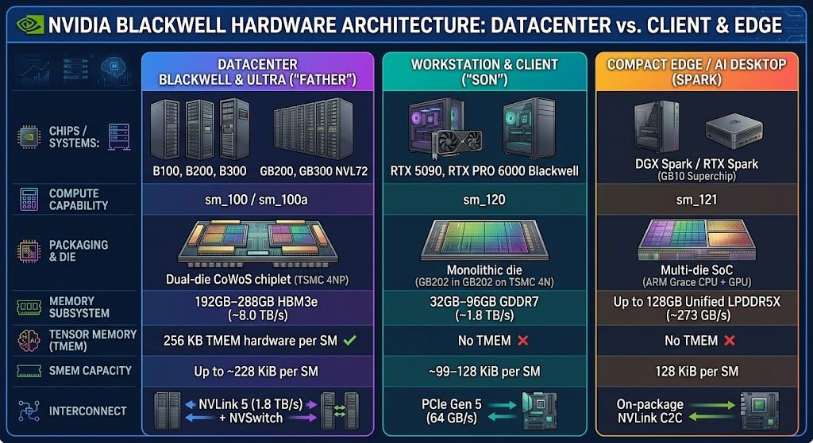

# EDU AI LAB (localai.isnot.cheap)

Hey!!! Local AI is not CHEAP at ALL! - **Every AI token carries a COST!** 

Running **local AI** is far from free - it simply shifts the invoice from a cloud vendor to your own balance sheet. 

Between high-end GPU based systems, surging electricity and cooling bills, server maintenance, and the specialized engineering talent required to keep inference pipelines optimized, self-hosting brings massive real-life capital and operational expenses.

Metering and tracking internal teams by the token is essential: it creates accountability against wasteful compute loops and directly amortizes those upfront infrastructure, pipelines, and staffing investments.

## So how to measure and track AI tokens in a small AI lab? 

This is tricky architectural and engineering challenge with plenty of tradeoffs, ideal EDU AI LAB material.

Here I put a minimal single-node setup distilled from the large ones I use in enterprise workshops, to demonstrate the complexity of Local AI Inference Engineering in practice and the role of caching.

This single-node setup is built to run as an educational lab on a home gaming PC with an Nvidia GPU with 12GB of VRAM. See more in the "Will it fit considerations" section below.

If you are new to LLM serving aka Inference Engineering, I recommend you to look into EDU sources first at [localai.isnot.cheap](https://localai.isnot.cheap).

## Selecting AI heart for LAB - small, but capable LLM (~3B SLM)

Everybody is starting in AI by tinkering with models, not with architecture - so we will **follow the crowd** here:

**PS:** *No embedded vision* — we focus primarily on text-only LLM (SLM) models; this limits simulated tests, but the multimodal Pandora's box will be another chapter.

### Open-weight champion - The Swiss army knife

Liquid AI released a new [LFM2.5-2.6B: Deploy Agents Everywhere](https://www.liquid.ai/blog/lfm2-5-2-6b) on 4 August 2026!

It's a third-generation sub-3B model with a hybrid architecture, small enough for reasoning and tool calling, with a full 128K context window to handle the long inputs that agentic workloads require.

It has full support in all three engines we will use:
 - llama.cpp — GGUF checkpoints for efficient edge inference
 - vLLM — GPU-accelerated serving for production throughput
 - SGLang — GPU-accelerated serving for production throughput
 - MLX — Optimized inference for Apple Silicon
 - ONNX — Cross-platform inference across diverse accelerators

Useful quantizations:

Full LFM2.5-2.6B model is 5.4 GB in bf16, we can easily run 8bit quantizations:

 - GGUF [Official LiquidAI (8-bit Q8_0 = 2.87 GB)](https://huggingface.co/LiquidAI/LFM2.5-2.6B-GGUF)
 - W8A16 [AutoRound W8A16 (8-bit weights / fp16 activations = 2.9 GB)](https://huggingface.co/plavno/LFM2.5-2.6B-AutoRound-W8A16)

The lab's vLLM and SGLang profiles run the AutoRound W8A16 checkpoint, while llama.cpp serves the Q8_0 GGUF.

There are a lot of modified and uncensored variants of LFM2.5-2.6B:

 A Little Uncensored:

  - [LFM2.5-2.6B-Uncensored-GGUF](https://huggingface.co/SC117/LFM2.5-2.6B-Uncensored-GGUF)
  - [LFM2.5-2.6B-Heretic-Abliterated-GGUF](https://huggingface.co/Abiray/LFM2.5-2.6B-Heretic-Abliterated-GGUF)
  - [LFM2.5-2.6B-UNCENSORED-ABLITERATED-PHILADELPHIA-CLASS](https://huggingface.co/KridgeDookie/LFM2.5-2.6B-UNCENSORED-ABLITERATED-PHILADELPHIA-CLASS)

 A Little Specialized:

  - [LFM-2.5-Coder-2.6B GGUF](https://huggingface.co/Schnuckade/LFM-2.5-Coder-2.6B)
  - [LFM2.5-2.6b-fable5-coding-agent](https://huggingface.co/AyoubChLin/lfm2.5-2.6b-fable5-coding-agent) [GGUF](https://huggingface.co/AyoubChLin/LFM2.5-2.6B-fable5-coding-agent-GGUF) 
  - [LFM2.5-2.6B-Terminal-SFT](https://huggingface.co/jacepark12/LFM2.5-2.6B-Terminal-SFT) [GGUF](https://huggingface.co/mradermacher/LFM2.5-2.6B-Terminal-SFT-GGUF) 
  - [LFM2.5-2.6B-CyberSec](https://huggingface.co/reaperdoesntknow/LFM2.5-2.6B-CyberSec) [GGUF](https://huggingface.co/mradermacher/LFM2.5-2.6B-Terminal-SFT-GGUF) 

I recommend familiarizing yourself with the LFM 2.5 2.6B model in [LM Studio](https://lmstudio.ai/). It is trained on a whopping ~34 trillion tokens, so we generated and tested diverse topic sets.

### Open-source champion - The king of Open Science

Hugging Face created the 3B model [SmolLM3: smol, multilingual, long-context reasoner](https://huggingface.co/blog/smollm3)

It's built on top of 11T tokens and the full recipe is open (including datasets), so we can more easily generate synthetic tests.

It's a dual reasoner - reasoning can be switched off/on and it has a 64K context window, context scaling in SmolLM3 is not fully linear so 64K is more realistic (128K is stretched and will not FIT!).

Useful quantizations:

Full SmolLM3-3B model is 6.17 GB in bf16, we can easily run 8bit quantizations:

 - GGUF [SmolLM3-3B-GGUF (8-bit Q8_0 = 3.28 GB)](https://huggingface.co/unsloth/SmolLM3-3B-GGUF)
 - FP8 [FP8 Dynamic (8-bit FP8 = 3.4 GB)](https://huggingface.co/RedHatAI/SmolLM3-3B-FP8-dynamic)

## Selecting embedding models for the LAB - a matryoshka-capable embedder

- we can also use CPU cores for embeddings with F16 format, Q8_0 for GPU.
- we will use modern [matryoshka - multi-dimensional embeddings](https://huggingface.co/blog/matryoshka)
- we will primarily focus on English - embeddings are domain-specific, larger models can do:
  - other human languages (some better than others)
  - code (programming languages)
  - have fine-tuned variants for special domains

### Primary embedder

**nomic-embed-text-v1.5 by Nomic**

- **Max chunk size:** 8192
- **Dimensions:** 768, 512, 256, 128, 64 (trade-off between size & performance)
- **Languages:** Primary language is English (fully optimized and benchmarked)

[nomic-ai/nomic-embed-text-v1.5 GGUF F16](https://huggingface.co/nomic-ai/nomic-embed-text-v1.5-GGUF)
[nomic-ai/nomic-embed-text-v1.5 GGUF Q8_0](https://huggingface.co/nomic-ai/nomic-embed-text-v1.5-GGUF)
[nomic-ai/nomic-embed-text-v1.5 SF F16](https://huggingface.co/nomic-ai/nomic-embed-text-v1.5)

### Alternative embedders around 300M

We can also try Google's [embeddinggemma](https://ai.google.dev/gemma/docs/embeddinggemma) or IBM's [granite-embedding-311m-multilingual-r2](https://huggingface.co/ibm-granite/granite-embedding-311m-multilingual-r2).

**embeddinggemma by Google**

- **Model size:** 300M, ~200M in RAM when quantized (we'll test Q4)
- **Max chunk size:** 2048
- **Dimensions:** 768, 512, 256, 128 (trade-off between size & performance)
- **Languages:** Wide linguistic data understanding, trained in over 100 languages.

[mradermacher/embeddinggemma-300m-GGUF (F16)](https://huggingface.co/mradermacher/embeddinggemma-300m-GGUF)
[unsloth/embeddinggemma-300m-GGUF (BF16)](https://huggingface.co/unsloth/embeddinggemma-300m-GGUF)
[unsloth/embeddinggemma-300m-GGUF (Q8_0)](https://huggingface.co/unsloth/embeddinggemma-300m-GGUF)
[unsloth/embeddinggemma-300m-GGUF (Q4_0)](https://huggingface.co/unsloth/embeddinggemma-300m-GGUF)

**granite-embedding-311m-multilingual-r2 by IBM**

- **Model size:** 311M
- **Max chunk size:** 32768
- **Dimensions:** 768, 512, 384, 256, 128 (trade-off between size & performance)
- **Languages:** 200+ languages, plus enhanced support for 52 languages and programming code

## EDU AI LAB OVERVIEW:

```text
=============================================================================================
         EDU AI LAB: localai.isnot.cheap  —  "Every AI token carries a COST!"
=============================================================================================

                           [ Users / Teams / Apps ]
                                      │
                                      │ (1. API Request + Virtual Key)
                                      ▼
┌───────────────────────────────────────────────────────────────────────────┐ ┌─────────────┐
│                           LITELLM (AI GATEWAY)                            │ │  LLAMA.UI   │
│     • Request Interception & Quota Checks (Users/Teams/Apps)              │ │             │
│     • Cache Layer: Exact / Semantic Response Matching                     │ │ • manual    │
│     • Rate Limiting (TPM/RPM) & Dynamic Cost Calculation                  │ │  debugging  │
│     • OTLP Trace Export to Phoenix                                        │ │  (point to  │
│     • MCP Gateway: MCP and namespaced tools                               │ │   srv API)  │
│     • Skills HUB: Set of useful skills                                    │ │             │
└───────┬────────────────────────────────┬───────────────────────────────┬──┘ └─────────────┘
        │                                │                               │
        │ (2. Cache Lookup               │ (3. Cache Miss:               │ (4. OTLP Trace &)
        │     Auth Key Check)            │     Inference Request)        │     Usage Events)
        ▼                                ▼                               ▼
┌───────────────────────┐ ┌───────────────────────────────┐ ┌────────────────────────────────┐
│        REDIS          │ │   LOCAL AI INFERENCE ENGINE   │ │    PHOENIX (OBSERVABILITY)     │
│ LiteLLM Cache:        │ │ [ llama.cpp | vLLM | SGLang ] │ │ • OTLP Trace Ingestion         │
│ • Response Cache Hit  │ │ • GPU / CPU Acceleration      │ │ • Token Counting & Model Costs │
│ • Auth Key Validation │ │ • Model Prefill & Decode      │ │ • Runtime / Latency Metrics    │
│ • TPM / RPM Counters  │ │ • Prefix / KV-Cache Hit       │ │ • MCP Server (/mcp)            │
└───────────────────────┘ └────────────┬──────────────────┘ └────────┬───────────────────────┘
                                       │                             │
    (8. MCP Tools)                     │ (5. Prometheus              │ (6. Spans, Token
                                       │     /metrics Scrape)        │     Counts & Costs)
                                       ▼                             ▼
┌───────────────────────┐ ┌───────────────────────────┐ ┌────────────────────────────────────┐
│   ADMIN MCP SERVERS   │ │     VICTORIAMETRICS       │ │         POSTGRESQL (SHARED)        │
│ • LiteLLM Admin MCP   │ │ • Engine Metrics Store    │ │ • LiteLLM DB: Spend Logs, Budgets  │
│ • VictoriaMetrics MCP │ │ • GPU / Host Utilization  │ │ • Phoenix DB: Traces, Spans, Cost  │
│ • Phoenix MCP         │ └───────────────┬───────────┘ └───────────────────┬────────────────┘
│                       │                 │                                 │
│  LiteLLM  MCP Gateway │                 │       (7. Query & Insights)     │
│ • all Admin MCPs      │                 ▼                                 ▼
│                       │         ┌─────────────────────────────────────────────────────┐
│  LiteLLM  MCP custom  │         │            CUSTOM REPORT SCRIPTS (API/MCP)          │
│ • NameSpaced tools    │         │       (per-team cost / size / latency reports)      │
└───────────────────────┘         └─────────────────────────────────────────────────────┘
```
---

### How it Flows

1. **API Request with a Virtual Key (Users/Teams/Apps $\rightarrow$ LiteLLM):**
Every call enters through the gateway carrying a **virtual key** that identifies the user, team, or app behind it. LiteLLM intercepts the request, runs its quota and budget checks, and enforces **TPM/RPM** rate limits before anything heavy happens.

2. **Cache Lookup & Fast-Path Return (LiteLLM $\leftrightarrow$ Redis):**
LiteLLM checks **Redis** for an exact-match or semantic response first. On a hit, it serves the answer in sub-5ms with **zero compute cost** — the GPU never even wakes up.

3. **Inference Execution (LiteLLM $\rightarrow$ llama.cpp / vLLM / SGLang):**
On a cache miss, LiteLLM routes the prompt down to the local engine. The engine processes it using its own internal **KV/prefix cache** and streams back the generated tokens.

4. **Observability Emission (LiteLLM $\rightarrow$ Phoenix):**
LiteLLM exports an OTLP trace to Phoenix carrying the full usage footprint — prompt, completion, and **KV-cached** token counts — so every call can be priced and timed.

5. **Engine Metrics Collection (Engines $\rightarrow$ VictoriaMetrics):**
The engines and hosts expose their own metrics, which **VictoriaMetrics** scrapes and stores as GPU and host utilization data.

6. **Persistence & Insights (Phoenix $\rightarrow$ PostgreSQL):**
Phoenix persists the ingested spans, token counts, and cost attributes into the shared **PostgreSQL**, making the whole lab's usage queryable.

7. **Query & Insights (PostgreSQL $\leftarrow$ Report Scripts):**
Custom report scripts query the persisted trace and spend data to build per-team cost, size, and latency reports — the raw materials for the team accountability story.

8. **Agentic Access via MCP Tools (Agents $\rightarrow$ LiteLLM MCP Gateway $\rightarrow$ Admin MCPs):**
   - **Direct (Admin MCPs):** agents talk straight to an individual admin MCP server — Phoenix, VictoriaMetrics, or the LiteLLM admin MCP (for troubleshooting).
   - **Governed (MCP Gateway / Toolsets):** ideally agents don't touch raw infrastructure; they reach it through governed MCP access:
      - **Aggregated (MCP Gateway):** all three admin MCPs surface behind the gateway's single MCP endpoint, tools namespaced per server (`phoenix-*`, `victoriametrics-*`, `litellm_admin-*`).
      - **Managed (Toolsets):** curated, named subsets of tools pulled from across the servers, so each team only gets the slice of the lab they're meant to see.
---

### Will it RUN considerations

**Nvidia + CUDA is a MUST** — it's the primary environment in the enterprise and the neoclouds.

**AI EDU LAB limitation:** home gaming/workstation hardware is NOT the same as datacenter (DC) hardware. They differ at the hardware level — **CUDA + kernels + architecture (x86 vs ARM)** — so a solution finely tuned for the DC will not simply run on our home lab.



See the full technical deep-dive: [nn-nvidia-hw-deepdive.md](eduailab/nn-nvidia-hw-deepdive.md)

---

### Will it FIT considerations

*Footnote: I have dyslexia and I am not a native English speaker, so from time to time I let the LLMs give my English a power-up — think of it as a GPU-accelerated spellchecker running at a few hundred tokens per second. If any sentence here reads a little too polished, that was the model showing off, not me.*
